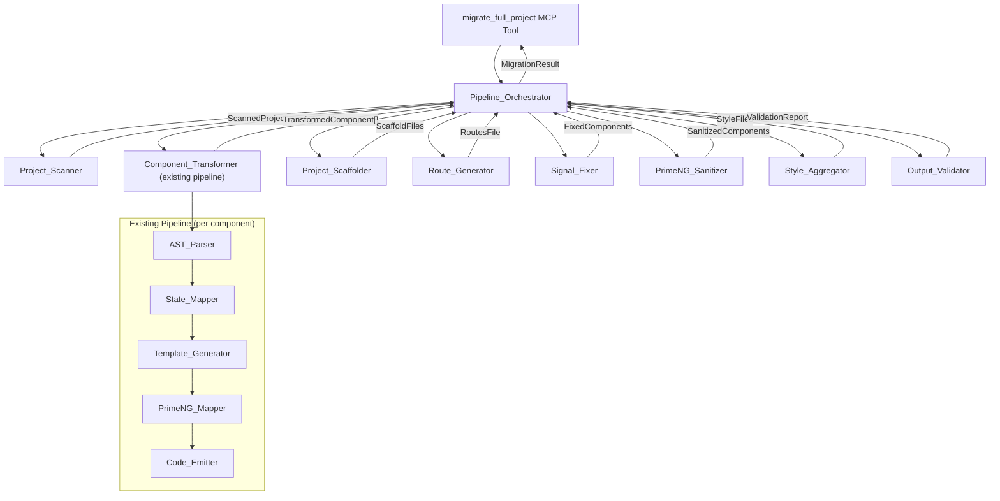
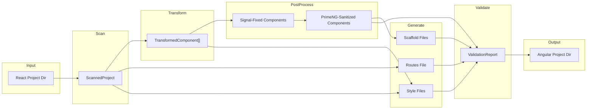

# Design Document: Full Project Migration Pipeline

## Overview

This design extends the existing `@cls/mcp-front-migrate` MCP server — which currently provides 10 tools for individual React component transformation — with a project-level orchestration layer. The new `migrate_full_project` MCP tool accepts an entire React project directory, scans every source file, runs each through the existing transformation pipeline, and emits a complete Angular 20 + PrimeNG 19 project ready to `npm install && ng serve`.

The pipeline is fully autonomous (zero user prompts), handles any React project structure (CRA, Vite, Next.js, class components, any UI library, TS or JS), and preserves visual fidelity by extracting all CSS — inline styles, CSS modules, Tailwind, CSS-in-JS, media queries, animations — into Angular `.component.scss` files.

### Key Design Decisions

1. **Reuse over rewrite**: The existing pipeline modules (`AST_Parser`, `State_Mapper`, `Template_Generator`, `PrimeNG_Mapper`, `Code_Emitter`) are reused as-is for per-component transformation. New modules wrap and orchestrate them.
2. **In-memory pipeline**: All file I/O happens at the boundaries (scan input, write output). Internal stages pass data structures, not files.
3. **Fail-forward with reporting**: A single component failure does not halt the pipeline. Errors are collected and returned in the validation report alongside the generated files.
4. **Dependency-ordered processing**: Components are topologically sorted by their import graph so child components are transformed before parents.

## Architecture



### Pipeline Execution Order

1. **Project_Scanner** — Recursively discover and classify all files; build dependency graph
2. **Component_Transformer** — For each component (in dependency order), run the existing 5-stage pipeline
3. **Style_Aggregator** — Extract and convert all CSS/SCSS/LESS/CSS-in-JS/inline styles
4. **Project_Scaffolder** — Generate Angular project skeleton files
5. **Route_Generator** — Analyze React Router usage and generate `app.routes.ts`
6. **Signal_Fixer** — Post-process templates and component classes for signal compatibility
7. **PrimeNG_Sanitizer** — Remove unsupported HTML attributes from PrimeNG components
8. **Output_Validator** — Validate structural completeness and known issues
9. **Return result** — Assemble all files into the output directory with migration summary

## Components and Interfaces

### 1. Pipeline_Orchestrator (`src/pipeline/project-orchestrator.ts`)

The top-level coordinator. Receives `MigrateFullProjectParams`, executes all stages sequentially, collects errors, and returns `FullMigrationResult`.

```typescript
export interface MigrateFullProjectParams {
  readonly sourceDir: string;
  readonly outputDir: string;
  readonly moduleName: string;
  readonly options?: MigrationOptions;
}

export interface MigrationOptions {
  readonly angularVersion?: string;       // default "20"
  readonly primeNgVersion?: string;       // default "19"
  readonly strictMode?: boolean;          // default true
  readonly baseApiUrl?: string;           // default "/servicios-core/api/v1/"
  readonly convertTailwind?: boolean;     // default false — if true, convert Tailwind to SCSS
}

export interface FullMigrationResult {
  readonly status: 'success' | 'error';
  readonly outputDir: string;
  readonly filesGenerated: readonly string[];
  readonly migrationSummary: MigrationSummary;
  readonly validationReport: readonly ValidationIssue[];
  readonly duration: number; // ms
  readonly errors?: readonly PipelineError[];
}

export interface MigrationSummary {
  readonly componentsTotal: number;
  readonly componentsMigrated: number;
  readonly componentsFailed: number;
  readonly servicesGenerated: number;
  readonly routesGenerated: number;
  readonly stylesGenerated: number;
  readonly staticAssetsCopied: number;
}

export interface PipelineError {
  readonly stage: string;
  readonly file: string;
  readonly message: string;
  readonly details?: string;
}
```

**Key method:**
```typescript
export async function migrateFullProject(
  params: MigrateFullProjectParams
): Promise<FullMigrationResult>
```

The orchestrator:
- Validates `sourceDir` exists and is readable
- Calls `scanProject()` to discover files
- Topologically sorts components by dependency graph
- Iterates components calling the existing per-component pipeline (`parseReactComponent` → `mapStateToAngular` → `generateAngularTemplate` → `mapToPrimeNG` → `emitAngularArtifact`)
- Calls `aggregateStyles()` for CSS extraction
- Calls `scaffoldProject()` for Angular skeleton
- Calls `generateRoutes()` for routing
- Calls `fixSignals()` for signal post-processing
- Calls `sanitizePrimeNG()` for attribute cleanup
- Calls `validateOutput()` for final checks
- Assembles all files into `outputDir`

### 2. Project_Scanner (`src/pipeline/project-scanner.ts`)

Recursively discovers and classifies all files in the React project.

```typescript
export interface ScannedProject {
  readonly rootDir: string;
  readonly components: readonly ScannedFile[];
  readonly services: readonly ScannedFile[];
  readonly styles: readonly ScannedFile[];
  readonly configs: readonly ScannedFile[];
  readonly assets: readonly ScannedFile[];
  readonly dependencyGraph: ReadonlyMap<string, readonly string[]>; // component → its child components
  readonly projectMeta: ProjectMeta;
}

export interface ScannedFile {
  readonly path: string;         // relative to rootDir
  readonly absolutePath: string;
  readonly content: string;
  readonly category: FileCategory;
}

export type FileCategory = 'component' | 'service' | 'style' | 'config' | 'asset';

export interface ProjectMeta {
  readonly packageManager: 'npm' | 'yarn' | 'pnpm';
  readonly buildTool: 'cra' | 'vite' | 'nextjs' | 'remix' | 'webpack-custom' | 'unknown';
  readonly hasTypeScript: boolean;
  readonly hasRouter: boolean;
  readonly uiLibraries: readonly string[];
  readonly stateManagement: readonly string[];
  readonly srcDir: string;  // detected source directory (e.g., "src", "app", "pages")
}
```

**Classification logic:**
- **Components**: Files with `.tsx`/`.jsx` extension that export a function returning JSX (detected via quick regex + Babel parse)
- **Services**: `.ts`/`.js` files containing `fetch`, `axios`, or HTTP client calls without JSX returns
- **Styles**: `.css`, `.scss`, `.less` files
- **Configs**: `package.json`, `tsconfig.json`, `.babelrc`, `vite.config.*`, `next.config.*`
- **Assets**: Files in `public/` or `static/` directories (images, fonts, icons)

**Exclusion patterns**: `node_modules/**`, `dist/**`, `build/**`, `.next/**`, `*.test.*`, `*.spec.*`, `*.stories.*`, `__tests__/**`, `__mocks__/**`

**Dependency graph construction**: For each component file, parse import statements. If an import resolves to another component file in the project, add an edge. Use topological sort (Kahn's algorithm) to determine processing order.

**Build tool detection**:
- CRA: `react-scripts` in `package.json` dependencies
- Vite: `vite` in devDependencies or `vite.config.*` exists
- Next.js: `next` in dependencies or `next.config.*` exists
- Remix: `@remix-run/react` in dependencies
- Webpack custom: `webpack` in devDependencies without `react-scripts`

**Package manager detection**: Check for `package-lock.json` (npm), `yarn.lock` (yarn), `pnpm-lock.yaml` (pnpm).

### 3. Component_Transformer (existing pipeline, wrapped)

No new module — the orchestrator calls the existing pipeline functions directly:

```typescript
// For each scanned component:
const ir = parseReactComponent(file.content);          // AST_Parser
const irWithState = mapStateToAngular(ir);             // State_Mapper
const irWithTemplate = generateAngularTemplate(irWithState); // Template_Generator
const irWithPrimeNG = mapToPrimeNG(irWithTemplate);    // PrimeNG_Mapper
const artifact = emitAngularArtifact(irWithPrimeNG);   // Code_Emitter
```

**Class component handling** (Requirement 15.3): Before calling `parseReactComponent`, a pre-processor detects class components (`extends React.Component` or `extends Component`) and converts them to functional equivalents:
- `this.state.x` → `useState` call
- `this.setState({x})` → setter call
- `componentDidMount` → `useEffect(() => {}, [])`
- `componentWillUnmount` → `useEffect` cleanup
- `render()` return → function return
- `React.memo` / `React.forwardRef` wrappers are unwrapped before parsing

### 4. Project_Scaffolder (`src/pipeline/project-scaffolder.ts`)

Generates the Angular project skeleton.

```typescript
export interface ScaffoldFiles {
  readonly files: ReadonlyMap<string, string>; // path → content
}

export function scaffoldProject(
  moduleName: string,
  componentNames: readonly string[],
  options: MigrationOptions,
  projectMeta: ProjectMeta,
): ScaffoldFiles
```

**Generated files:**

| File | Description |
|------|-------------|
| `package.json` | Angular 20 + PrimeNG 19 + dependencies |
| `angular.json` | Build/serve/test targets, styles array |
| `tsconfig.json` | `strict: true`, `ES2022`, Angular compiler options |
| `tsconfig.app.json` | App-specific TS config extending base |
| `src/main.ts` | `bootstrapApplication(AppComponent, appConfig)` |
| `src/app/app.config.ts` | `provideRouter`, `provideHttpClient`, `provideAnimationsAsync`, `provideZoneChangeDetection` |
| `src/app/app.component.ts` | Root component with `<router-outlet>` |
| `src/index.html` | HTML shell with `<app-root>`, meta tags |
| `src/styles.scss` | Global styles importing SB theme + PrimeNG |

If `projectMeta` indicates Tailwind usage and `convertTailwind` is false, also generates `tailwind.config.js` and adds Tailwind to `package.json`.

### 5. Route_Generator (`src/pipeline/route-generator.ts`)

Analyzes React Router usage and generates Angular routes.

```typescript
export interface GeneratedRoute {
  readonly path: string;
  readonly componentName: string;
  readonly componentPath: string; // relative import path
  readonly isLazy: boolean;
}

export function generateRoutes(
  scannedProject: ScannedProject,
  transformedComponents: ReadonlyMap<string, TransformedComponent>,
): string // app.routes.ts content
```

**Detection strategy:**
1. Search for imports from `react-router-dom` or `react-router` in all component files
2. Extract `<Route path="..." component={...} />` and `<Route path="..." element={<.../>} />` patterns
3. Extract route definitions from `createBrowserRouter` / `createRoutesFromElements` calls
4. For Next.js: derive routes from `pages/` or `app/` directory structure
5. Map each route's component to its Angular equivalent
6. Generate `app.routes.ts` with `loadComponent` lazy loading

If no router is detected, generate a default single-route config pointing to the main component.

### 6. Signal_Fixer (`src/pipeline/signal-fixer.ts`)

Post-processes generated code to fix Angular signal compatibility issues.

```typescript
export function fixSignals(
  components: ReadonlyMap<string, TransformedComponent>,
): Map<string, TransformedComponent>
```

**Fixes applied:**
1. Replace `[(ngModel)]="signalName"` → `[ngModel]="signalName()" (ngModelChange)="signalName.set($event)"` in all `.component.html` files
2. Ensure signal reads use `()` syntax in interpolations (`{{ signalName() }}`), `@if` conditions, `@for` collections, and property bindings (`[value]="signalName()"`)
3. Scan each `.component.ts` for signal references in the template that lack a corresponding `signal()`, `computed()`, or `input()` declaration — add missing declarations with type-inferred defaults
4. Ensure `FormsModule` is imported when `ngModel` is used

### 7. PrimeNG_Sanitizer (`src/pipeline/primeng-sanitizer.ts`)

Removes unsupported HTML attributes from PrimeNG components.

```typescript
export function sanitizePrimeNG(
  components: ReadonlyMap<string, TransformedComponent>,
): Map<string, TransformedComponent>
```

**Sanitization rules:**
- Remove `required` attribute from: `p-select`, `p-dropdown`, `p-checkbox`, `p-radioButton`, `p-inputSwitch`, `p-calendar`, `p-autoComplete`, `p-multiSelect`
- Ensure PrimeNG 19 import paths (e.g., `primeng/select` not `primeng/dropdown` for Select)
- Ensure standalone component API imports (no NgModule-style imports)

### 8. Style_Aggregator (`src/pipeline/style-aggregator.ts`)

Extracts and converts all CSS from the React project into Angular `.component.scss` files.

```typescript
export interface StyleExtractionResult {
  readonly componentStyles: ReadonlyMap<string, string>;  // componentName → scss content
  readonly globalStyles: string;                           // styles.scss content
  readonly themeFile: string;                              // _sb-primeng-theme.scss content
}

export function aggregateStyles(
  scannedProject: ScannedProject,
  transformedComponents: ReadonlyMap<string, TransformedComponent>,
  options: MigrationOptions,
): StyleExtractionResult
```

**CSS extraction strategies:**

| Source | Strategy |
|--------|----------|
| `import './styles.css'` | Read file, scope rules under `:host`, copy to `.component.scss` |
| `import styles from './X.module.css'` | Read file, convert `styles.className` refs to plain `.className` in template, copy rules to `.component.scss` |
| `style={{ color: 'red' }}` | Already handled by Template_Generator as `[ngStyle]` binding — preserved |
| Tailwind classes | If `convertTailwind` option: convert to SCSS using SB design tokens. Otherwise: preserve classes, add Tailwind to project deps |
| styled-components / emotion | Parse tagged template literals, extract CSS rules, convert to static SCSS |
| MUI `sx` prop | Parse object expression, convert to CSS properties in `.component.scss` |
| Media queries | Copy verbatim into `.component.scss` |
| CSS animations / transitions | Copy verbatim into `.component.scss` |
| LESS files | Convert LESS variables to SCSS variables, copy rules |

**Global styles generation** (`src/styles.scss`):
```scss
@import 'primeng/resources/themes/lara-light-blue/theme.css';
@import 'primeng/resources/primeng.min.css';
@import 'primeicons/primeicons.css';
@import './styles/sb-primeng-theme';
// ... shared styles from React project's global CSS
```

### 9. Output_Validator (`src/pipeline/output-validator.ts`)

Validates the generated project for structural completeness.

```typescript
export interface ValidationIssue {
  readonly severity: 'error' | 'warning';
  readonly file: string;
  readonly message: string;
  readonly rule: string;
}

export function validateOutput(
  files: ReadonlyMap<string, string>,
  routes: readonly GeneratedRoute[],
): readonly ValidationIssue[]
```

**Validation rules:**
1. Every `.component.ts` has matching `.component.html`, `.component.scss`, `.component.spec.ts`
2. `package.json` contains all required Angular 20 + PrimeNG 19 dependencies
3. `app.routes.ts` references only existing components with valid import paths
4. No `.ts` file contains `: any` (must use `unknown`)
5. All components have `standalone: true`
6. No PrimeNG component has unsupported `required` attribute
7. No empty/placeholder files (files must have meaningful content)

### 10. MCP Tool Registration

The `migrate_full_project` tool is registered in `src/server.ts` alongside existing tools:

```typescript
server.tool(
  'migrate_full_project',
  'Migrates an entire React project to a complete Angular 20 + PrimeNG 19 project',
  {
    sourceDir: z.string().describe('Path to the React project directory'),
    outputDir: z.string().describe('Path for the Angular output directory'),
    moduleName: z.string().describe('Name of the Angular module/feature'),
    options: z.object({
      angularVersion: z.string().optional(),
      primeNgVersion: z.string().optional(),
      strictMode: z.boolean().optional(),
      baseApiUrl: z.string().optional(),
      convertTailwind: z.boolean().optional(),
    }).optional(),
  },
  async (args) => migrateFullProjectHandler(args),
);
```


### TransformedComponent (shared data type)

```typescript
export interface TransformedComponent {
  readonly originalPath: string;
  readonly componentName: string;
  readonly kebabName: string;
  readonly componentTs: string;
  readonly componentHtml: string;
  readonly componentScss: string;
  readonly componentSpec: string;
  readonly services: readonly ServiceFile[];
  readonly ir: ComponentIR;  // preserved for post-processing
}
```

## Data Models

### File Output Structure

The generated Angular project follows this directory layout:

```
{outputDir}/
├── package.json
├── angular.json
├── tsconfig.json
├── tsconfig.app.json
├── src/
│   ├── main.ts
│   ├── index.html
│   ├── styles.scss
│   ├── styles/
│   │   └── _sb-primeng-theme.scss
│   ├── assets/                          # copied from React public/static
│   │   ├── images/
│   │   └── fonts/
│   └── app/
│       ├── app.component.ts
│       ├── app.config.ts
│       ├── app.routes.ts
│       └── features/
│           └── {moduleName}/
│               ├── components/
│               │   ├── {component-a}/
│               │   │   ├── component-a.component.ts
│               │   │   ├── component-a.component.html
│               │   │   ├── component-a.component.scss
│               │   │   └── component-a.component.spec.ts
│               │   └── {component-b}/
│               │       └── ...
│               ├── services/
│               │   ├── {service-name}.service.ts
│               │   └── {service-name}.service.spec.ts
│               └── models/
│                   └── {model-name}.model.ts
```

### Data Flow Through Pipeline



### Class Component Pre-Processor

For Requirement 15.3, a pre-processing step converts class components before they enter the existing pipeline:

```typescript
export interface ClassComponentConversion {
  readonly originalSource: string;
  readonly convertedSource: string;  // functional component equivalent
  readonly wasClassComponent: boolean;
  readonly conversionNotes: readonly string[];
}

export function convertClassToFunctional(source: string): ClassComponentConversion
```

**Conversion mappings:**

| React Class Pattern | Functional Equivalent |
|---------------------|----------------------|
| `this.state = { x: 0 }` | `const [x, setX] = useState(0)` |
| `this.setState({ x: 1 })` | `setX(1)` |
| `this.setState(prev => ...)` | `setX(prev => ...)` |
| `componentDidMount()` | `useEffect(() => { ... }, [])` |
| `componentDidUpdate(prevProps)` | `useEffect(() => { ... })` |
| `componentWillUnmount()` | `useEffect(() => { return () => { ... } }, [])` |
| `this.props.x` | destructured prop `x` |
| `this.handleClick = ...` | `const handleClick = useCallback(...)` |
| `React.memo(Comp)` | unwrap, process inner component |
| `React.forwardRef((props, ref) => ...)` | unwrap, add `useRef` |

### State Management Conversion (Requirement 15.5)

```typescript
export interface StateManagementDetection {
  readonly library: 'redux' | 'zustand' | 'jotai' | 'recoil' | 'mobx' | 'context' | 'none';
  readonly storeFiles: readonly string[];
  readonly usages: readonly StateUsage[];
}

export interface StateUsage {
  readonly componentFile: string;
  readonly hookName: string;     // e.g., "useSelector", "useStore", "useAtom"
  readonly stateSlice: string;   // e.g., "user.name"
}
```

**Conversion strategy:**
- Redux `useSelector` / `useDispatch` → Angular service with signals + `inject()`
- Zustand `useStore` → Angular service with signals
- Jotai `useAtom` → Angular signal
- Recoil `useRecoilState` → Angular signal
- MobX `observer` → Angular signal + `computed()`
- React Context `useContext` → Angular service with `inject()` (already handled by existing `State_Mapper`)

### CSS-in-JS Extraction (Requirement 14.8)

```typescript
export interface CSSInJSExtraction {
  readonly componentName: string;
  readonly extractedRules: readonly ExtractedCSSRule[];
  readonly warnings: readonly string[];
}

export interface ExtractedCSSRule {
  readonly selector: string;    // generated class name
  readonly properties: string;  // CSS property block
  readonly mediaQuery?: string; // wrapping media query if any
}

export function extractCSSInJS(source: string): CSSInJSExtraction
```

**Extraction strategies:**
- `styled-components`: Parse tagged template literals (`styled.div\`...\``) → extract CSS string
- `emotion`: Parse `css\`...\`` and `styled(...)` → extract CSS string
- MUI `sx` prop: Parse object expression → convert JS property names to CSS (`backgroundColor` → `background-color`)
- Convert extracted CSS to SCSS with SB design token substitution


## Correctness Properties

*A property is a characteristic or behavior that should hold true across all valid executions of a system — essentially, a formal statement about what the system should do. Properties serve as the bridge between human-readable specifications and machine-verifiable correctness guarantees.*

### Property 1: Parser round-trip count preservation

*For any* valid React component source code with N `useState` calls, M `useEffect` calls, K `useMemo` calls, and J `useCallback` calls, parsing with `AST_Parser` then emitting with `Code_Emitter` SHALL produce an Angular component containing exactly N signals, M effects, K computed values, and J methods.

**Validates: Requirements 3.3, 13.1**

### Property 2: Parser structural invariants

*For any* valid React component source code, the `AST_Parser` SHALL produce a `ComponentIR` where `componentName` is a non-empty string, `fileName` equals the kebab-case transformation of `componentName`, and `jsxTree` contains at least one node.

**Validates: Requirements 13.2**

### Property 3: Emitter produces valid TypeScript

*For any* `ComponentIR` with a non-empty `componentName` and a non-empty `angularTemplate`, the `Code_Emitter` SHALL produce a `.component.ts` string that parses as valid TypeScript (no syntax errors).

**Validates: Requirements 13.3**

### Property 4: File discovery completeness with exclusion

*For any* directory tree, the `Project_Scanner` SHALL return all files matching `*.tsx`, `*.jsx`, `*.ts`, `*.js`, `*.css`, `*.scss`, `*.less`, `*.json` AND shall exclude every file whose path matches `node_modules/**`, `dist/**`, `build/**`, `*.test.*`, `*.spec.*`, `*.stories.*`, `__tests__/**`, or `__mocks__/**`.

**Validates: Requirements 2.1, 2.3**

### Property 5: File classification correctness

*For any* discovered file, the `Project_Scanner` SHALL assign exactly one category from `{component, service, style, config, asset}`, and the category SHALL match the file's content characteristics (components have JSX returns, services have HTTP calls without JSX, styles are CSS/SCSS/LESS files).

**Validates: Requirements 2.2**

### Property 6: Dependency graph correctness

*For any* set of component files with import statements referencing other component files, the `Project_Scanner` SHALL produce a dependency graph where an edge from A to B exists if and only if A imports B.

**Validates: Requirements 2.4**

### Property 7: Topological processing order

*For any* component dependency graph (DAG), the `Pipeline_Orchestrator` SHALL process components in an order where every component is processed after all of its children (dependencies), i.e., the processing order is a valid topological sort of the dependency graph.

**Validates: Requirements 3.5**

### Property 8: Component file completeness

*For any* successfully transformed component, the output SHALL contain exactly four files: `{kebab-name}.component.ts`, `{kebab-name}.component.html`, `{kebab-name}.component.scss`, and `{kebab-name}.component.spec.ts`.

**Validates: Requirements 3.2, 8.1, 10.1**

### Property 9: Error resilience — valid components survive invalid siblings

*For any* set of N component files where K are valid and (N-K) are invalid, the `Pipeline_Orchestrator` SHALL successfully transform all K valid components and return error records for the (N-K) invalid ones.

**Validates: Requirements 3.4**

### Property 10: Scaffold dependency completeness

*For any* generated `package.json`, it SHALL contain all of: `@angular/core`, `@angular/common`, `@angular/router`, `@angular/forms`, `@angular/platform-browser`, `@angular/compiler`, `primeng`, `@angular/animations`, `zone.js`, `rxjs`, `tslib` as dependencies, and `typescript` (≥5.8) as a devDependency.

**Validates: Requirements 4.1, 10.2**

### Property 11: No extraneous files

*For any* generated project, every file SHALL be in the allowed set (component files, service files, model files, configuration files, theme files, asset files), no file SHALL be empty or contain only TODO comments, and Tailwind/federation/shell files SHALL be absent unless explicitly requested via options.

**Validates: Requirements 4.7, 11.1, 11.2, 11.3**

### Property 12: Route generation with lazy loading and valid imports

*For any* React Router configuration with N route definitions, the `Route_Generator` SHALL produce N Angular routes where every route uses `loadComponent` for lazy loading and every route's import path resolves to an existing component file in the generated project.

**Validates: Requirements 5.1, 5.2, 5.3, 10.3**

### Property 13: Signal compatibility — template signal reads and ngModel

*For any* generated template containing signal references, the `Signal_Fixer` SHALL ensure: (a) all `[(ngModel)]="signalName"` occurrences are replaced with `[ngModel]="signalName()" (ngModelChange)="signalName.set($event)"`, and (b) all signal reads in interpolations, property bindings, `@if` conditions, and `@for` collections use the `signalName()` call syntax.

**Validates: Requirements 6.1, 6.4**

### Property 14: Signal declaration completeness

*For any* generated component, after the `Signal_Fixer` runs, every signal name referenced in the template SHALL have a corresponding `signal()`, `computed()`, or `input()` declaration in the component class.

**Validates: Requirements 6.2, 6.3**

### Property 15: PrimeNG attribute sanitization

*For any* generated template containing PrimeNG components (`p-select`, `p-dropdown`, `p-checkbox`, `p-radioButton`, `p-inputSwitch`, `p-calendar`, `p-autoComplete`, `p-multiSelect`), the `PrimeNG_Sanitizer` SHALL remove all `required` HTML attributes from those components.

**Validates: Requirements 7.1, 10.6**

### Property 16: CSS import extraction

*For any* React component that imports a CSS/SCSS/LESS file, the `Style_Aggregator` SHALL include all CSS rules from that file in the corresponding Angular `.component.scss` file.

**Validates: Requirements 8.5, 14.1**

### Property 17: CSS preservation — layout, media queries, animations

*For any* CSS rule in the React project's stylesheets that defines layout properties (flexbox, grid, positioning), media queries, or animations/transitions, the `Style_Aggregator` SHALL include that rule verbatim in the corresponding Angular `.component.scss` file.

**Validates: Requirements 14.5, 14.6, 14.7**

### Property 18: CSS Module conversion

*For any* React component using CSS Modules (`styles.className`), the `Style_Aggregator` SHALL convert module references to plain CSS class names in the Angular template and copy the corresponding CSS rules into the component's `.scss` file.

**Validates: Requirements 14.3**

### Property 19: CSS-in-JS extraction

*For any* React component using styled-components, emotion, or MUI `sx` prop, the `Style_Aggregator` SHALL extract the CSS rules from the JavaScript expressions and produce equivalent static SCSS rules in the component's `.scss` file.

**Validates: Requirements 14.8**

### Property 20: Service generation with correct HTTP mapping

*For any* service file containing `fetch` or `axios` calls, the pipeline SHALL generate an Angular `@Injectable` service where each HTTP call is mapped to the correct `HttpClient` method (`get`/`post`/`put`/`delete`/`patch`), uses `Observable` return types, uses the configured base URL, and has a corresponding `.service.spec.ts` file.

**Validates: Requirements 9.1, 9.2, 9.3, 9.4**

### Property 21: Pipeline error response structure

*For any* non-recoverable error during pipeline execution, the `Pipeline_Orchestrator` SHALL return a response containing the failing stage name and error details, and SHALL not have executed any stages after the failing one.

**Validates: Requirements 1.3**

### Property 22: Pipeline success response structure

*For any* successful pipeline execution, the response SHALL contain `status: "success"`, `outputDir`, a non-empty `filesGenerated` array, a `migrationSummary` with correct counts matching the actual generated files, a `validationReport` array, and a positive `duration` value.

**Validates: Requirements 1.4, 12.3**

### Property 23: Validation report with files on failure

*For any* pipeline execution where validation issues are found, the `Output_Validator` SHALL return both the generated files AND a list of all validation errors with file paths and descriptions.

**Validates: Requirements 10.7**

### Property 24: No `any` type in generated TypeScript

*For any* generated TypeScript file (excluding `.spec.ts`), the file SHALL not contain the type annotation `: any` — `unknown` SHALL be used instead.

**Validates: Requirements 10.4**

### Property 25: All components use standalone: true

*For any* generated `.component.ts` file, the `@Component` decorator SHALL include `standalone: true`.

**Validates: Requirements 10.5**

### Property 26: Project metadata detection

*For any* React project directory, the `Project_Scanner` SHALL correctly detect the package manager (by presence of `package-lock.json` → npm, `yarn.lock` → yarn, `pnpm-lock.yaml` → pnpm) and the build tool (by `package.json` dependencies and config files).

**Validates: Requirements 15.1, 15.2**

### Property 27: Universal component pattern handling

*For any* React component written as a function component, arrow function component, class component, or component wrapped in `React.memo` / `React.forwardRef`, the `Component_Transformer` SHALL produce a valid Angular standalone component.

**Validates: Requirements 15.3**

### Property 28: TypeScript and JavaScript handling

*For any* React project containing JavaScript source files (`.js`/`.jsx`), the pipeline SHALL produce typed Angular output, using `unknown` as the fallback type where types cannot be inferred.

**Validates: Requirements 15.6**

### Property 29: Standard output directory structure

*For any* React project with any input directory structure, the Angular output SHALL follow the standard feature-module layout: `src/app/features/{moduleName}/components/`, `src/app/features/{moduleName}/services/`, `src/app/features/{moduleName}/models/`.

**Validates: Requirements 15.7**

### Property 30: Static asset copying

*For any* file in the React project's `public/` or `static/` directory, the `Project_Scanner` SHALL copy it to the Angular project's `src/assets/` directory.

**Validates: Requirements 15.8**


## Error Handling

### Error Categories

| Category | Stage | Behavior |
|----------|-------|----------|
| **Invalid source directory** | Pre-pipeline | Return error immediately, no stages execute |
| **Empty project** | Project_Scanner | Return error with descriptive message |
| **Component parse failure** | Component_Transformer | Log error, skip component, continue with remaining |
| **Style extraction failure** | Style_Aggregator | Log warning, generate stub `.scss`, continue |
| **Route detection failure** | Route_Generator | Generate default single-route config, log warning |
| **Signal fix failure** | Signal_Fixer | Log warning, leave component as-is |
| **Validation failure** | Output_Validator | Return files alongside validation report (non-blocking) |
| **File system write failure** | Output assembly | Return error with partial results |

### Error Response Structure

All errors follow the `PipelineError` interface:

```typescript
{
  stage: string;    // e.g., "Component_Transformer"
  file: string;     // e.g., "src/components/UserProfile.tsx"
  message: string;  // human-readable error description
  details?: string; // stack trace or additional context
}
```

### Fail-Forward Strategy

The pipeline uses a fail-forward approach for component-level errors:
1. If a single component fails to parse/transform, it is skipped and the error is recorded
2. All remaining components continue processing
3. The final result includes both the successfully generated files and the error list
4. The `migrationSummary` reflects accurate counts (`componentsFailed` > 0)
5. The `validationReport` includes warnings about skipped components

Only project-level errors (invalid source directory, empty project, file system failures) halt the entire pipeline.

## Testing Strategy

### Dual Testing Approach

This feature uses both unit tests and property-based tests for comprehensive coverage.

**Property-based testing library**: `fast-check` (already in devDependencies)

### Property-Based Tests

Each correctness property from the design document is implemented as a property-based test using `fast-check`. Tests are configured with a minimum of 100 iterations per property.

**Tag format**: `Feature: full-project-migration-pipeline, Property {number}: {property_text}`

**Test file locations**:
- `tests/properties/project-scanner.prop.test.ts` — Properties 4, 5, 6, 26, 30
- `tests/properties/project-orchestrator.prop.test.ts` — Properties 7, 9, 11, 21, 22, 23
- `tests/properties/component-transformer.prop.test.ts` — Properties 1, 2, 3, 8, 27, 28
- `tests/properties/signal-fixer.prop.test.ts` — Properties 13, 14
- `tests/properties/primeng-sanitizer.prop.test.ts` — Property 15
- `tests/properties/style-aggregator.prop.test.ts` — Properties 16, 17, 18, 19
- `tests/properties/route-generator.prop.test.ts` — Property 12
- `tests/properties/output-validator.prop.test.ts` — Properties 24, 25
- `tests/properties/service-generator.prop.test.ts` — Property 20
- `tests/properties/scaffolder.prop.test.ts` — Properties 10, 29

**Generators needed** (extend existing `tests/properties/generators/`):
- `react-project.gen.ts` — Generates random React project directory structures with components, services, styles, configs
- `css-rules.gen.ts` — Generates random CSS rules (layout, media queries, animations, CSS-in-JS)
- `route-config.gen.ts` — Generates random React Router configurations
- `component-patterns.gen.ts` — Generates random React components in different patterns (function, arrow, class, memo, forwardRef)

### Unit Tests

Unit tests cover specific examples, edge cases, and integration points:

- `tests/unit/project-scanner.test.ts` — Edge cases: empty directory, non-existent path, Next.js pages/ structure, mixed TS/JS
- `tests/unit/project-scaffolder.test.ts` — Specific file content verification (package.json deps, angular.json structure, tsconfig options)
- `tests/unit/route-generator.test.ts` — Edge cases: no router, nested routes, dynamic routes, Next.js file-based routing
- `tests/unit/signal-fixer.test.ts` — Specific signal fix patterns, FormsModule injection
- `tests/unit/primeng-sanitizer.test.ts` — Specific attribute removal patterns
- `tests/unit/style-aggregator.test.ts` — CSS Module conversion, Tailwind handling, CSS-in-JS extraction examples
- `tests/unit/output-validator.test.ts` — Specific validation rule examples
- `tests/unit/class-component-converter.test.ts` — Class component to functional conversion examples

### Integration Tests

- `tests/integration/full-project-migration.test.ts` — End-to-end test with a small sample React project, verifying the complete pipeline produces a valid Angular project
- `tests/integration/mcp-migrate-tool.test.ts` — MCP tool registration and invocation test

