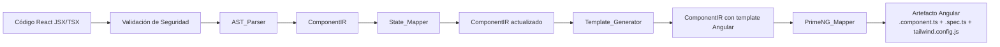
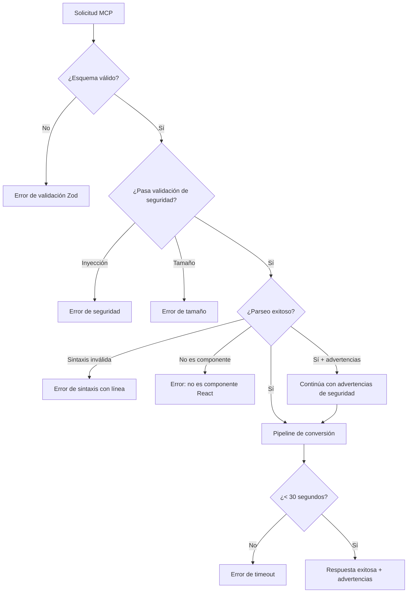

# Documento de Diseño: react-to-angular-mcp

## Visión General

Este documento describe el diseño técnico de un servidor MCP (Model Context Protocol) implementado en Node.js + TypeScript que convierte código React (JSX/TSX) a código Angular 19+ moderno. El servidor expone tres herramientas vía protocolo stdio: `convert_react_to_angular`, `generate_microfrontend_shell` y `generate_angular_module`.

El motor de conversión (Conversion_Engine) se compone de cuatro módulos encadenados en pipeline: AST_Parser → State_Mapper → Template_Generator → PrimeNG_Mapper. Cada módulo transforma una representación intermedia (IR) del componente, permitiendo extensibilidad y testeo independiente.

### Decisiones de Diseño Clave

1. **Pipeline de transformación basado en IR**: Se utiliza una representación intermedia tipada (`ComponentIR`) que fluye entre módulos. Esto desacopla cada etapa y facilita el testing unitario de cada transformación.
2. **@babel/parser para análisis AST**: Babel es el estándar de facto para parsear JSX/TSX, con soporte completo de TypeScript y JSX. Se usa `@babel/parser` + `@babel/traverse` para extraer la estructura del componente React.
3. **@modelcontextprotocol/sdk para el servidor MCP**: El SDK oficial de TypeScript proporciona `McpServer` y `StdioServerTransport` para implementar el protocolo MCP sobre stdio con registro declarativo de herramientas.
4. **Generación de código mediante templates**: Se usan templates de string con interpolación para generar código Angular, en lugar de construir un AST de salida, ya que el código generado es predecible y estructurado.
5. **Validación con Zod**: Los esquemas de entrada de cada herramienta MCP se validan con Zod, integrado nativamente con el SDK de MCP.

### Hallazgos de Investigación

- El SDK MCP de TypeScript (`@modelcontextprotocol/sdk`) usa `McpServer` con `StdioServerTransport` para servidores locales. Las herramientas se registran con `.tool(name, schema, handler)` usando esquemas Zod. ([Fuente](https://ts.sdk.modelcontextprotocol.io/documents/server.html))
- `@angular-architects/native-federation` es la implementación estándar de Module Federation para Angular sin dependencia de Webpack, compatible con Angular 19+. Usa `loadRemoteModule` para carga dinámica. ([Fuente](https://github.com/angular-architects/module-federation-plugin))
- `@babel/parser` con plugins `jsx` y `typescript` parsea JSX/TSX a AST. `@babel/traverse` permite recorrer el árbol para extraer hooks, props, estado y estructura del componente. ([Fuente](https://babeljs.io/docs/babel-parser))

## Arquitectura

```mermaid
graph TB
    subgraph "Cliente AI"
        AI[Google AI Studio / Cursor / Claude]
    end

    subgraph "MCP Server (stdio)"
        TRANSPORT[StdioServerTransport]
        SERVER[McpServer]
        VALIDATOR[Validador Zod]
        
        subgraph "Herramientas MCP"
            T1[convert_react_to_angular]
            T2[generate_microfrontend_shell]
            T3[generate_angular_module]
        end

        subgraph "Conversion Engine Pipeline"
            AST[AST_Parser<br/>@babel/parser + traverse]
            SM[State_Mapper]
            TG[Template_Generator]
            PM[PrimeNG_Mapper]
        end

        subgraph "Generadores"
            SG[Shell Generator]
            MG[Module Generator]
        end
    end

    AI <-->|stdio JSON-RPC| TRANSPORT
    TRANSPORT <--> SERVER
    SERVER --> VALIDATOR
    VALIDATOR --> T1
    VALIDATOR --> T2
    VALIDATOR --> T3
    T1 --> AST
    AST --> SM
    SM --> TG
    TG --> PM
    PM -->|Artefacto Angular| T1
    T2 --> SG
    T3 --> MG
```

### Flujo de Datos Principal (convert_react_to_angular)



## Componentes e Interfaces

### 1. MCP Server (`src/server.ts`)

Punto de entrada del servidor. Registra las tres herramientas MCP y gestiona el transporte stdio.

```typescript
// Inicialización del servidor
import { McpServer } from '@modelcontextprotocol/sdk/server/mcp.js';
import { StdioServerTransport } from '@modelcontextprotocol/sdk/server/stdio.js';

const server = new McpServer({
  name: 'react-to-angular-mcp',
  version: '1.0.0',
});

// Registro de herramientas con esquemas Zod
server.tool('convert_react_to_angular', convertSchema, convertHandler);
server.tool('generate_microfrontend_shell', shellSchema, shellHandler);
server.tool('generate_angular_module', moduleSchema, moduleHandler);
```

### 2. AST_Parser (`src/pipeline/ast-parser.ts`)

Analiza código JSX/TSX usando `@babel/parser` y `@babel/traverse`. Extrae la estructura completa del componente React y produce un `ComponentIR`.

**Interfaz:**
```typescript
function parseReactComponent(sourceCode: string): ComponentIR;
```

**Responsabilidades:**
- Parsear JSX/TSX a AST con `@babel/parser` (plugins: `jsx`, `typescript`)
- Extraer nombre del componente, props con tipos, hooks (useState, useEffect, useMemo, useCallback, useRef, useContext), métodos y JSX tree
- Detectar componentes hijos importados
- Validar que el código contiene un componente React válido
- Detectar patrones inseguros (`dangerouslySetInnerHTML`, `eval`, `document.write`)

### 3. State_Mapper (`src/pipeline/state-mapper.ts`)

Transforma los patrones de estado React extraídos por el AST_Parser a sus equivalentes Angular 19+.

**Interfaz:**
```typescript
function mapStateToAngular(ir: ComponentIR): ComponentIR;
```

**Tabla de Mapeo:**

| React Hook | Angular 19+ Equivalente |
|---|---|
| `useState(init)` | `signal<T>(init)` |
| `useEffect(fn, deps)` | `effect(() => { ... })` |
| `useMemo(fn, deps)` | `computed(() => fn())` |
| `useCallback(fn, deps)` | Método del componente |
| `useRef(init)` (DOM) | `viewChild<ElementRef>('ref')` |
| `useRef(init)` (valor) | Propiedad de clase |
| `useContext(Ctx)` | `inject(ServiceName)` |
| Hook personalizado `useX` | Servicio inyectable `XService` |

### 4. Template_Generator (`src/pipeline/template-generator.ts`)

Convierte el JSX tree del `ComponentIR` a una plantilla Angular con sintaxis moderna de control de flujo.

**Interfaz:**
```typescript
function generateAngularTemplate(ir: ComponentIR): ComponentIR;
```

**Mapeos de Plantilla:**

| JSX | Angular 19+ |
|---|---|
| `{cond && <X/>}` | `@if (cond) { <X/> }` |
| `{cond ? <A/> : <B/>}` | `@if (cond) { <A/> } @else { <B/> }` |
| `{arr.map(x => <X/>)}` | `@for (x of arr; track x.id) { <X/> }` |
| `onClick={handler}` | `(click)="handler()"` |
| `onChange={handler}` | `(change)="handler($event)"` |
| `className={expr}` | `[class]="expr"` |
| `style={obj}` | `[ngStyle]="obj"` |
| `disabled={bool}` | `[disabled]="bool"` |
| `className="tw-classes"` | `class="tw-classes"` |

**Regla de plantilla inline vs archivo separado:** < 50 líneas → inline en `@Component({ template: ... })`; ≥ 50 líneas → archivo `.component.html` separado.

### 5. PrimeNG_Mapper (`src/pipeline/primeng-mapper.ts`)

Reemplaza elementos HTML nativos por componentes PrimeNG equivalentes en la plantilla Angular generada.

**Interfaz:**
```typescript
function mapToPrimeNG(ir: ComponentIR): ComponentIR;
```

**Tabla de Mapeo PrimeNG:**

| HTML Nativo | PrimeNG |
|---|---|
| `<button>` | `<p-button>` |
| `<input type="text">` | `<input pInputText>` |
| `<select>` | `<p-dropdown>` |
| `<table>` | `<p-table>` |
| `<input type="checkbox">` | `<p-checkbox>` |
| `<textarea>` | `<textarea pInputTextarea>` |
| `<dialog>` / modal | `<p-dialog>` |

Elementos sin equivalente PrimeNG se preservan sin modificación. El mapper agrega automáticamente las importaciones de módulos PrimeNG al array `imports` del componente standalone.

### 6. Shell Generator (`src/generators/shell-generator.ts`)

Genera una Shell_App Angular con Native Federation configurada.

**Interfaz:**
```typescript
function generateShellApp(config: ShellConfig): ShellAppArtifact;
```

### 7. Module Generator (`src/generators/module-generator.ts`)

Genera una Remote_App Angular con configuración de Native Federation.

**Interfaz:**
```typescript
function generateRemoteApp(config: ModuleConfig): RemoteAppArtifact;
```

### 8. Security Validator (`src/security/validator.ts`)

Valida y sanitiza el código fuente React antes del procesamiento.

**Interfaz:**
```typescript
function validateInput(sourceCode: string): ValidationResult;
```

**Responsabilidades:**
- Rechazar entradas con patrones de inyección (`eval`, `Function`, imports dinámicos de URLs externas)
- Limitar tamaño de entrada a 500 KB
- Detectar y advertir sobre patrones inseguros (`dangerouslySetInnerHTML`, `document.write`)

### 9. Code Emitter (`src/emitter/code-emitter.ts`)

Genera los archivos finales del Artefacto Angular a partir del `ComponentIR` completamente transformado.

**Interfaz:**
```typescript
function emitAngularArtifact(ir: ComponentIR): AngularArtifact;
```

**Genera:**
- `.component.ts` — Componente standalone con signals, inject(), control flow moderno
- `.spec.ts` — Pruebas unitarias con TestBed
- `tailwind.config.js` — Configuración de Tailwind con preset PrimeNG


## Modelos de Datos

### ComponentIR (Representación Intermedia)

Estructura central que fluye a través del pipeline de conversión. Cada módulo la enriquece progresivamente.

```typescript
interface ComponentIR {
  // Metadatos del componente
  componentName: string;
  fileName: string; // kebab-case derivado del nombre

  // Extraído por AST_Parser
  props: PropDefinition[];
  state: StateDefinition[];
  effects: EffectDefinition[];
  memos: MemoDefinition[];
  callbacks: CallbackDefinition[];
  refs: RefDefinition[];
  contexts: ContextDefinition[];
  customHooks: CustomHookDefinition[];
  methods: MethodDefinition[];
  childComponents: string[];
  jsxTree: JSXNode;
  typeInterfaces: TypeInterfaceDefinition[];

  // Generado por State_Mapper
  angularSignals: SignalDefinition[];
  angularEffects: AngularEffectDefinition[];
  angularComputed: ComputedDefinition[];
  angularInjections: InjectionDefinition[];
  angularServices: ServiceDefinition[];
  angularViewChildren: ViewChildDefinition[];
  classProperties: ClassPropertyDefinition[];
  componentMethods: AngularMethodDefinition[];

  // Generado por Template_Generator
  angularTemplate: string;
  isInlineTemplate: boolean; // true si < 50 líneas
  templateBindings: BindingDefinition[];

  // Generado por PrimeNG_Mapper
  primeNgImports: PrimeNGImport[];
  securityWarnings: SecurityWarning[];
}

interface PropDefinition {
  name: string;
  type: string; // Tipo TypeScript
  defaultValue?: string;
  isRequired: boolean;
}

interface StateDefinition {
  variableName: string;
  setterName: string;
  type: string;
  initialValue: string;
}

interface EffectDefinition {
  body: string; // Código del efecto
  dependencies: string[];
  cleanupFunction?: string;
}

interface MemoDefinition {
  variableName: string;
  computeFunction: string;
  dependencies: string[];
  type: string;
}

interface CallbackDefinition {
  functionName: string;
  body: string;
  parameters: ParameterDefinition[];
  dependencies: string[];
}

interface RefDefinition {
  variableName: string;
  initialValue: string;
  isDomRef: boolean; // true → viewChild, false → propiedad de clase
  type: string;
}

interface ContextDefinition {
  variableName: string;
  contextName: string;
  type: string;
}

interface CustomHookDefinition {
  hookName: string;
  serviceName: string; // Nombre del servicio Angular generado
  parameters: ParameterDefinition[];
  returnType: string;
  internalHooks: string[]; // Hooks usados internamente
  body: string;
}

interface JSXNode {
  tag: string;
  attributes: JSXAttribute[];
  children: (JSXNode | JSXExpression | string)[];
  isComponent: boolean; // true si es un componente React (PascalCase)
}

interface JSXAttribute {
  name: string;
  value: string | JSXExpression;
  isEventHandler: boolean;
  isDynamic: boolean;
}

interface JSXExpression {
  type: 'conditional' | 'ternary' | 'map' | 'switch' | 'interpolation';
  expression: string;
  children?: JSXNode[];
  alternate?: JSXNode[];
}

interface PrimeNGImport {
  moduleName: string; // e.g., 'ButtonModule'
  importPath: string; // e.g., 'primeng/button'
}

interface SecurityWarning {
  line: number;
  pattern: string;
  message: string;
  severity: 'warning' | 'error';
}

interface SignalDefinition {
  name: string;
  type: string;
  initialValue: string;
  originalStateName: string;
}

interface ParameterDefinition {
  name: string;
  type: string;
}

interface TypeInterfaceDefinition {
  name: string;
  body: string; // Código TypeScript de la interfaz
}
```

### ShellConfig

```typescript
interface ShellConfig {
  appName: string;
  remotes: RemoteRoute[];
}

interface RemoteRoute {
  name: string;
  path: string; // Ruta en el router Angular
  remoteEntry: string; // URL del remoteEntry.js
  exposedModule: string; // Módulo expuesto por el remoto
}
```

### ShellAppArtifact

```typescript
interface ShellAppArtifact {
  appConfig: string; // app.config.ts con provideRouter
  appRoutes: string; // app.routes.ts con loadRemoteModule
  federationConfig: string; // federation.config.js
  tailwindConfig: string; // tailwind.config.js compartido
  appComponent: string; // app.component.ts con router-outlet
  cspMeta: string; // Configuración CSP para index.html
}
```

### ModuleConfig

```typescript
interface ModuleConfig {
  moduleName: string;
  components: ExposedComponent[];
}

interface ExposedComponent {
  name: string;
  path: string; // Ruta relativa al componente
}
```

### RemoteAppArtifact

```typescript
interface RemoteAppArtifact {
  federationConfig: string; // federation.config.js con exposes
  components: GeneratedComponent[]; // Componentes placeholder si no existen
  appConfig: string; // app.config.ts
}

interface GeneratedComponent {
  componentFile: string; // .component.ts
  specFile: string; // .spec.ts
  isPlaceholder: boolean;
}
```

### AngularArtifact

```typescript
interface AngularArtifact {
  componentFile: string; // Contenido del .component.ts
  specFile: string; // Contenido del .spec.ts
  tailwindConfig: string; // Contenido del tailwind.config.js
  templateFile?: string; // Contenido del .component.html (si no es inline)
  services: ServiceFile[]; // Servicios generados de hooks personalizados
  securityWarnings: SecurityWarning[];
}

interface ServiceFile {
  fileName: string;
  content: string;
}
```

### ValidationResult

```typescript
interface ValidationResult {
  isValid: boolean;
  errors: ValidationError[];
  warnings: SecurityWarning[];
  sanitizedCode?: string; // Código limpio si es válido
}

interface ValidationError {
  type: 'syntax' | 'security' | 'size' | 'timeout' | 'invalid_component';
  message: string;
  line?: number;
  column?: number;
}
```


## Propiedades de Correctitud

*Una propiedad es una característica o comportamiento que debe mantenerse verdadero en todas las ejecuciones válidas de un sistema — esencialmente, una declaración formal sobre lo que el sistema debe hacer. Las propiedades sirven como puente entre especificaciones legibles por humanos y garantías de correctitud verificables por máquinas.*

### Propiedad 1: Completitud del artefacto de conversión

*Para cualquier* código fuente React válido (componente funcional que exporta JSX), la herramienta `convert_react_to_angular` SHALL producir un artefacto que contenga exactamente tres archivos: un `.component.ts` (componente standalone), un `.spec.ts` (pruebas unitarias con TestBed), y un `tailwind.config.js`.

**Valida: Requisitos 2.1, 9.1, 11.1**

### Propiedad 2: Extracción completa del AST con preservación de tipos

*Para cualquier* componente funcional React con TypeScript que contenga cualquier combinación de props, useState, useEffect, useMemo, useCallback, useRef, useContext, métodos e imports de componentes hijos, el AST_Parser SHALL extraer todos los elementos presentes en el código fuente y preservar todas las anotaciones de tipo TypeScript en el ComponentIR resultante.

**Valida: Requisitos 3.1, 3.2, 3.3**

### Propiedad 3: Rechazo de código sin componente React válido

*Para cualquier* código TypeScript que no contenga un export de función que retorne JSX, el AST_Parser SHALL retornar un error indicando que no se encontró un componente React válido.

**Valida: Requisitos 3.4**

### Propiedad 4: Mapeo correcto de hooks React a equivalentes Angular 19+

*Para cualquier* componente React que contenga cualquier combinación de hooks (useState, useEffect, useMemo, useCallback, useRef, useContext, hooks personalizados), el State_Mapper SHALL transformar cada hook a su equivalente Angular 19+ correcto (signal, effect, computed, método, viewChild/propiedad, inject, servicio inyectable respectivamente), preservando tipos y valores iniciales.

**Valida: Requisitos 4.1, 4.2, 4.3, 4.4, 4.5, 4.6, 4.7**

### Propiedad 5: Transformación correcta de estructuras de control JSX

*Para cualquier* plantilla JSX que contenga expresiones condicionales (ternarios, `&&`), iteraciones (`.map()`), o expresiones switch, el Template_Generator SHALL producir los bloques de control de flujo Angular equivalentes (`@if`/`@else`, `@for` con `track`, `@switch`/`@case`).

**Valida: Requisitos 5.1, 5.2, 5.3**

### Propiedad 6: Transformación correcta de atributos y event bindings JSX

*Para cualquier* elemento JSX con event handlers (`onClick`, `onChange`, `onSubmit`) o atributos dinámicos (`className={expr}`, `style={obj}`, `disabled={bool}`), el Template_Generator SHALL producir los event bindings (`(click)`, `(change)`, `(submit)`) y property bindings (`[class]`, `[ngStyle]`, `[disabled]`) Angular equivalentes.

**Valida: Requisitos 5.4, 5.5**

### Propiedad 7: Preservación de clases Tailwind CSS

*Para cualquier* elemento JSX con `className` que contenga clases de Tailwind CSS, el Template_Generator SHALL preservar todas las clases Tailwind en el atributo `class` del elemento Angular generado sin pérdida ni modificación.

**Valida: Requisitos 5.6**

### Propiedad 8: Umbral de plantilla inline vs archivo separado

*Para cualquier* plantilla Angular generada, si tiene menos de 50 líneas SHALL ser inline dentro del decorador `@Component`, y si tiene 50 líneas o más SHALL generarse como archivo `.component.html` separado.

**Valida: Requisitos 5.7**

### Propiedad 9: Equivalencia estructural de ida y vuelta

*Para cualquier* código fuente React válido, el artefacto Angular generado SHALL contener la misma cantidad de elementos interactivos, bindings de datos y estructuras de control que el componente React original.

**Valida: Requisitos 5.8**

### Propiedad 10: Mapeo correcto de elementos HTML a PrimeNG

*Para cualquier* plantilla con elementos HTML nativos que tengan equivalente PrimeNG (`<button>`, `<input type="text">`, `<select>`, `<table>`, `<input type="checkbox">`, `<textarea>`, `<dialog>`), el PrimeNG_Mapper SHALL reemplazarlos por sus equivalentes PrimeNG correspondientes, y para elementos sin equivalente PrimeNG SHALL preservarlos sin modificación.

**Valida: Requisitos 6.1, 6.2, 6.3, 6.4, 6.5, 6.6, 6.7, 6.9**

### Propiedad 11: Consistencia de importaciones PrimeNG

*Para cualquier* plantilla Angular generada que contenga componentes PrimeNG, el array `imports` del Standalone_Component SHALL contener exactamente los módulos PrimeNG correspondientes a los componentes presentes en la plantilla — ni más, ni menos.

**Valida: Requisitos 6.8**

### Propiedad 12: Completitud de Shell_App con rutas y federación

*Para cualquier* configuración de shell con un nombre de aplicación y una lista no vacía de rutas remotas, la Shell_App generada SHALL contener rutas lazy configuradas para cada remoto y un `federation.config.js` que declare todos los remotos.

**Valida: Requisitos 7.1, 7.2**

### Propiedad 13: Completitud de Remote_App con federación

*Para cualquier* configuración de módulo con un nombre y una lista de componentes a exponer, la Remote_App generada SHALL contener un `federation.config.js` con `exposes` para cada componente listado.

**Valida: Requisitos 8.1, 8.2**

### Propiedad 14: Cobertura de pruebas generadas según contenido del componente

*Para cualquier* componente Angular convertido, el archivo `.spec.ts` generado SHALL incluir pruebas de creación y renderizado, y adicionalmente SHALL incluir pruebas de reactividad de signals si el componente contiene signals, y pruebas de eventos si el componente contiene event handlers.

**Valida: Requisitos 9.2, 9.3, 9.4**

### Propiedad 15: Rechazo de patrones de inyección de código

*Para cualquier* código fuente React que contenga patrones de inyección (`eval`, `Function` constructor, imports dinámicos de URLs externas), el validador de seguridad SHALL rechazar la entrada con un error descriptivo.

**Valida: Requisitos 10.1**

### Propiedad 16: Detección y mitigación de patrones inseguros

*Para cualquier* código fuente React que contenga patrones potencialmente inseguros (`dangerouslySetInnerHTML`, `eval` en contexto de renderizado, `document.write`), el AST_Parser SHALL emitir una advertencia de seguridad y el código Angular generado SHALL usar `[innerHTML]` con sanitización explícita vía `DomSanitizer`.

**Valida: Requisitos 10.7**

### Propiedad 17: Interpolaciones seguras en plantillas

*Para cualquier* interpolación de texto en la plantilla Angular generada, el Template_Generator SHALL usar la interpolación estándar de Angular `{{ }}` que aplica sanitización automática.

**Valida: Requisitos 10.3**

### Propiedad 18: Validación de esquema de parámetros MCP

*Para cualquier* solicitud MCP con parámetros que no cumplan el esquema Zod definido para una herramienta, el servidor SHALL responder con un error de validación que describa los campos inválidos.

**Valida: Requisitos 1.5**

### Propiedad 19: Convenciones de naming de Angular en código generado

*Para cualquier* componente React convertido, el código Angular generado SHALL seguir las convenciones de naming de Angular: kebab-case para nombres de archivo, PascalCase para nombres de clase, camelCase para métodos y propiedades.

**Valida: Requisitos 12.1**

### Propiedad 20: Comentarios de mapeo en código generado

*Para cualquier* conversión que transforme hooks de React a equivalentes Angular, el código generado SHALL incluir comentarios que indiquen el mapeo realizado (por ejemplo: `// Convertido de useState → signal()`).

**Valida: Requisitos 12.3**

### Propiedad 21: Validez sintáctica del TypeScript generado

*Para cualquier* código fuente React válido, el artefacto Angular generado SHALL ser código TypeScript sintácticamente válido que pueda ser parseado sin errores por el compilador de TypeScript.

**Valida: Requisitos 12.4**

### Propiedad 22: Error descriptivo para JSX inválido

*Para cualquier* código fuente con sintaxis JSX inválida, el AST_Parser SHALL retornar un error que incluya la línea y el tipo de error de sintaxis.

**Valida: Requisitos 2.2**


## Manejo de Errores

### Categorías de Error

| Categoría | Origen | Comportamiento |
|---|---|---|
| **Error de sintaxis JSX/TSX** | AST_Parser | Retorna error MCP con línea, columna y tipo de error. No se procesa el pipeline. |
| **Componente React inválido** | AST_Parser | Retorna error indicando que no se encontró un componente React válido (sin export de función que retorne JSX). |
| **Error de validación de esquema** | Validador Zod / McpServer | Retorna error MCP estándar con descripción de campos inválidos. Manejado automáticamente por el SDK MCP. |
| **Herramienta no registrada** | McpServer | Retorna error MCP estándar indicando que la herramienta no existe. Manejado por el SDK. |
| **Patrón de inyección detectado** | Security Validator | Rechaza la entrada con error de seguridad. No se procesa el pipeline. |
| **Tamaño excedido (> 500 KB)** | Security Validator | Rechaza con error `size_exceeded`. |
| **Timeout (> 30 segundos)** | MCP Server | Cancela la operación con `AbortController` y retorna error `timeout`. |
| **Patrón inseguro detectado** | AST_Parser | Emite advertencia en la respuesta pero continúa la conversión generando código seguro. |
| **Error interno del pipeline** | Cualquier módulo | Captura la excepción, envuelve en error MCP con contexto del módulo que falló. |

### Estrategia de Propagación



### Formato de Error MCP

Todos los errores siguen el formato estándar de respuesta MCP:

```typescript
{
  content: [{
    type: 'text',
    text: JSON.stringify({
      success: false,
      error: {
        type: 'syntax_error' | 'validation_error' | 'security_error' | 'size_exceeded' | 'timeout' | 'invalid_component' | 'internal_error',
        message: string,
        details?: {
          line?: number,
          column?: number,
          field?: string,
          pattern?: string,
        }
      }
    })
  }],
  isError: true
}
```

## Estrategia de Testing

### Enfoque Dual: Tests Unitarios + Tests de Propiedades

Este proyecto utiliza un enfoque dual de testing:

- **Tests unitarios (ejemplo)**: Verifican casos específicos, edge cases y condiciones de error con ejemplos concretos.
- **Tests de propiedades (PBT)**: Verifican propiedades universales que deben cumplirse para todas las entradas válidas, usando generación aleatoria de inputs.

Ambos son complementarios: los tests unitarios capturan bugs concretos, los tests de propiedades verifican correctitud general.

### Librería de Property-Based Testing

Se utilizará **fast-check** (`fc`) como librería de PBT para TypeScript/Node.js. Es la librería PBT más madura del ecosistema TypeScript, con soporte nativo para generadores de strings, objetos, arrays y composición de generadores.

### Configuración de Tests de Propiedades

- Mínimo **100 iteraciones** por test de propiedad
- Cada test de propiedad referencia su propiedad del documento de diseño
- Formato de tag: **Feature: react-to-angular-mcp, Property {número}: {texto de la propiedad}**
- Se implementa cada propiedad de correctitud con un **único** test de propiedad

### Generadores Personalizados Necesarios

Para los tests de propiedades, se necesitan generadores de:

1. **Componentes React válidos**: Generador que produce código JSX/TSX con combinaciones aleatorias de hooks, props, métodos, y estructura JSX.
2. **Fragmentos JSX**: Generador de árboles JSX con elementos HTML, componentes, condicionales, iteraciones y atributos.
3. **Hooks React**: Generador de declaraciones useState, useEffect, useMemo, useCallback, useRef, useContext con tipos y valores aleatorios.
4. **Configuraciones de Shell/Module**: Generador de ShellConfig y ModuleConfig con nombres y rutas aleatorias.
5. **Código inválido**: Generador de código con errores de sintaxis o sin componente React válido.
6. **Código con patrones inseguros**: Generador que inyecta patrones como `eval`, `dangerouslySetInnerHTML` en código React válido.

### Estructura de Tests

```
tests/
├── unit/                          # Tests unitarios (ejemplo)
│   ├── server.test.ts             # Tests del servidor MCP (Req 1)
│   ├── ast-parser.test.ts         # Tests del AST Parser (Req 3)
│   ├── state-mapper.test.ts       # Tests del State Mapper (Req 4)
│   ├── template-generator.test.ts # Tests del Template Generator (Req 5)
│   ├── primeng-mapper.test.ts     # Tests del PrimeNG Mapper (Req 6)
│   ├── shell-generator.test.ts    # Tests del Shell Generator (Req 7)
│   ├── module-generator.test.ts   # Tests del Module Generator (Req 8)
│   ├── security-validator.test.ts # Tests de seguridad (Req 10)
│   └── code-emitter.test.ts       # Tests del Code Emitter (Req 9, 11, 12)
├── properties/                    # Tests de propiedades (PBT)
│   ├── generators/                # Generadores personalizados fast-check
│   │   ├── react-component.gen.ts
│   │   ├── jsx-tree.gen.ts
│   │   ├── hooks.gen.ts
│   │   └── config.gen.ts
│   ├── conversion.prop.test.ts    # Props 1, 9, 21 (pipeline completo)
│   ├── ast-parser.prop.test.ts    # Props 2, 3, 22
│   ├── state-mapper.prop.test.ts  # Prop 4
│   ├── template.prop.test.ts      # Props 5, 6, 7, 8, 17
│   ├── primeng.prop.test.ts       # Props 10, 11
│   ├── shell.prop.test.ts         # Prop 12
│   ├── module.prop.test.ts        # Prop 13
│   ├── spec-gen.prop.test.ts      # Prop 14
│   ├── security.prop.test.ts      # Props 15, 16
│   ├── naming.prop.test.ts        # Props 19, 20
│   └── validation.prop.test.ts    # Prop 18
└── integration/                   # Tests de integración
    ├── mcp-protocol.test.ts       # Comunicación stdio end-to-end
    └── full-conversion.test.ts    # Conversiones completas de componentes reales
```

### Framework de Testing

- **Vitest** como test runner (compatible con TypeScript, rápido, soporte ESM nativo)
- **fast-check** para property-based testing
- Tests ejecutados con `vitest --run` (sin modo watch)

### Tests Unitarios Clave (Ejemplos)

| Test | Requisito | Descripción |
|---|---|---|
| Listado de herramientas MCP | 1.2, 1.3 | Verifica que tools/list retorna 3 herramientas con esquemas completos |
| Herramienta no registrada | 1.4 | Verifica error MCP para herramienta inexistente |
| Pipeline secuencial | 2.3 | Verifica orden de ejecución AST→State→Template→PrimeNG |
| loadRemoteModule en Shell | 7.3 | Verifica uso de la API de Native Federation |
| Shell con remotos vacíos | 7.4 | Verifica generación de estructura base sin remotos |
| Componente placeholder | 8.4 | Verifica generación de placeholder para componente inexistente |
| Standalone con PrimeNG | 8.3 | Verifica que componentes remotos son standalone con PrimeNG |
| DomSanitizer | 10.2 | Verifica uso de sanitizador para contenido dinámico |
| Límite 500 KB | 10.4 | Verifica rechazo de entrada > 500 KB |
| CSP en Shell | 10.6 | Verifica configuración CSP |
| Preset PrimeNG en Tailwind | 11.2 | Verifica preset en tailwind.config.js |
| Tailwind compartido en Shell | 7.5 | Verifica configuración Tailwind en Shell_App |

